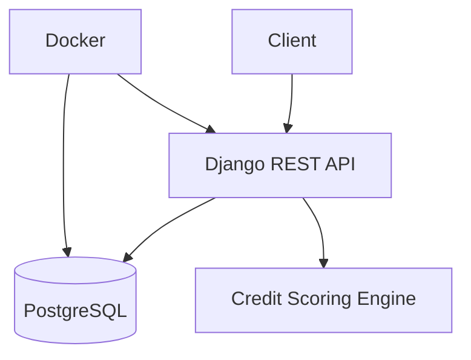

# 💳 Credit Approval System


---

## 📖 About The Project

The **Credit Approval System** is a Dockerized Django REST API designed to evaluate customer loan eligibility using a rule-based credit scoring mechanism.  

It calculates credit scores based on:
- Loan repayment history
- Current debt exposure
- Number of active loans
- Income levels
- Interest rate corrections

The system determines loan approval status and corrected interest rates while ensuring financial constraints such as the 50% income exposure rule.

---

## ✨ Key Features

- 🧮 Credit Score Calculation Engine  
- 📊 EMI Calculation Logic  
- 📉 Interest Rate Correction Slabs  
- 👤 Customer Registration  
- 🏦 Loan Creation & Management  
- 📄 View Customer Loans  
- 📂 Bulk Data Ingestion from Excel  
- 🐳 Fully Dockerized Setup  
- 🗄 PostgreSQL Database  
- 🔄 Automatic Migrations on Startup  

---

## 🏗️ Architecture

- **Backend:** Django 6 + Django REST Framework  
- **Database:** PostgreSQL  
- **Containerization:** Docker & Docker Compose  
- **Excel Handling:** OpenPyXL  
- **API Communication:** RESTful JSON APIs  



---

## 📁 Project Structure

```
credit-approval-system/
├── docker-compose.yml
├── Dockerfile
├── manage.py
├── requirements.txt
├── core/
├── customers/
├── loans/
└── scripts/
```

---

## ⚙️ Getting Started

### Prerequisites

- Docker
- Docker Compose

---

### 🐳 Run with Docker

```bash
docker-compose up --build
```

The API will be available at:

```
http://localhost:8000
```

---

## 📌 API Endpoints

- `POST /register` → Register new customer  
- `POST /check-eligibility` → Check loan eligibility  
- `POST /create-loan` → Create a loan  
- `GET /view-loan/<loan_id>` → View loan details  
- `GET /view-loans/<customer_id>` → View all loans for a customer  

---

## 🛣️ Roadmap

- [x] Credit Scoring Engine  
- [x] EMI Calculation  
- [x] Interest Slab Correction  
- [x] Docker Integration  
- [ ] Authentication & JWT  
- [ ] Admin Dashboard  
- [ ] Production Deployment  

---

## 📜 License

MIT License © 2025 Aryan Baadlas

---

## 📬 Contact

Aryan Baadlas  
Email: aryanbaadlas@gmail.com  
GitHub: https://github.com/be-a-guptaji

---

If you like this project, give it a star ⭐ on GitHub!
